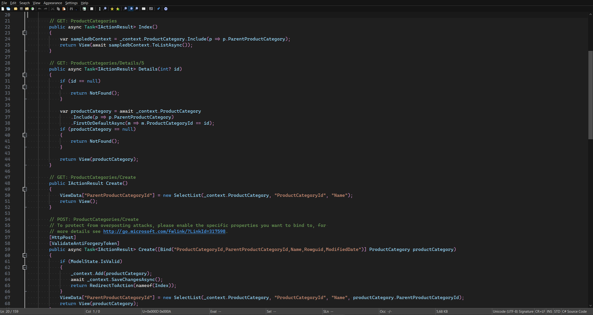
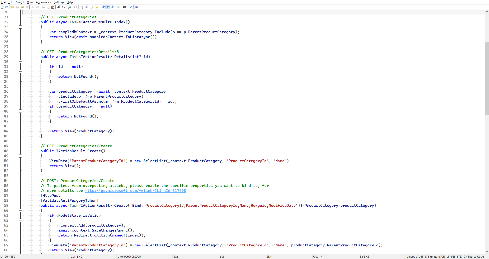

Notepad3 .ini theme files containing Visual Studio Code Modern themes.

# Installation
Paste the .ini files in a directory of choice (ex.: C:\Program Files\Notepad3\), and Go to Appearance -> Customize schemes... -> Import... and select pasted file.

# Screenshots
Dark theme:

Light theme:
